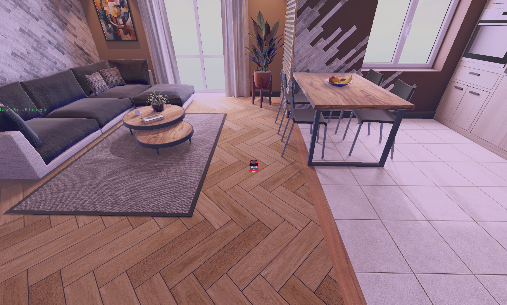
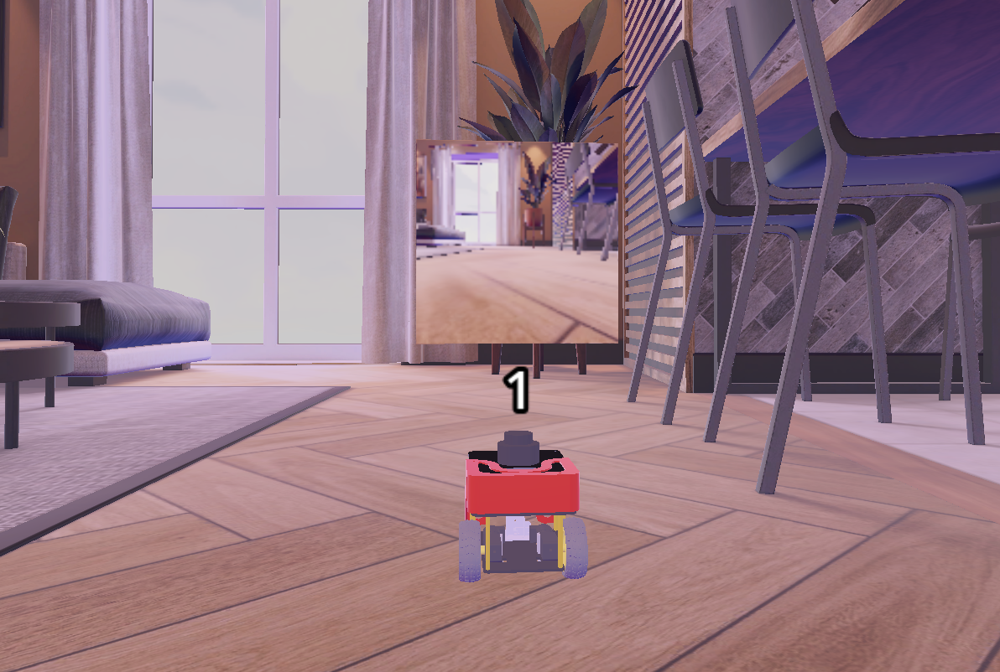

# Checkpoint 21 — FastBot Web Backend (ROS 2 stack)

ROS 2 Humble backend that powers the **FastBot Control Dashboard** — a browser-based teleop + navigation UI (see the sibling [`fastbot_webapp`](../../webpage_ws/fastbot_webapp/README.md) repo). This workspace serves **SLAM, localization, Nav2 navigation, 3D model description, and a TF/action/topic web bridge** over `rosbridge_websocket`, so the Vue frontend can visualize the map, robot, camera and issue `NavigateToPose` goals without any custom server code.

<p align="center">
  
</p>

## System Overview

```
┌─────────────────────────────────────────────────────────────┐
│  Browser — Vue.js dashboard (fastbot_webapp)                │
│  roslib · ros3djs · ros2djs · mjpegcanvas                   │
└──────────────────────▲──────────────────────────────────────┘
                       │ WebSocket (wss://…/rosbridge/)
                       │ JSON topics / services / actions
┌──────────────────────┴──────────────────────────────────────┐
│  rosbridge_suite  +  tf2_web_republisher_py  +  web_video   │
│                                                             │
│  Nav2 stack (this repo)     │   SLAM / Localization         │
│  ├─ planner_server           │   ├─ cartographer_slam       │
│  ├─ controller_server (DWB)  │   └─ localization_server     │
│  ├─ bt_navigator             │       (AMCL on fastbot_area) │
│  ├─ recoveries_server        │                              │
│  └─ lifecycle_manager        │   fastbot_description (URDF) │
│                              │   fastbot_topic_filter       │
│                              │   map_server (pgm/yaml)      │
└─────────────────────────────────────────────────────────────┘
                       │
                       ▼
               FastBot in Gazebo
   /fastbot_1/odom · /fastbot_1/scan · /fastbot_1/cmd_vel
   /fastbot_1/camera/image_raw · /fastbot_1_robot_description
```

Everything below is a namespaced per-robot setup (`fastbot_1`), so the same stack scales to multi-robot deployments.

## Packages

| Package | Role |
|---|---|
| `fastbot_description` | URDF/xacro + meshes + robot_state_publisher launch (published on `/fastbot_1_robot_description`, consumed by the `ROS3D.UrdfClient` in the webapp) |
| `cartographer_slam` | Online 2D SLAM — builds `fastbot_area.pgm` from `/fastbot_1/scan` + `/fastbot_1/odom` |
| `map_server` | Standalone `nav2_map_server` + lifecycle manager that serves the saved `fastbot_area.pgm` on `/map` |
| `localization_server` | `nav2_amcl` + map_server configured for the apartment environment (particle filter localization) |
| `fastbot_slam` | Complete Nav2 stack launch (controller + planner + BT navigator + behaviors + lifecycle) wired against `fastbot_1/*` topics |
| `fastbot_topic_filter` | De-duplicates `/fastbot_1/odom` and `/fastbot_1/scan` by header stamp — republishes on `_filtered` topics so downstream nodes don't process repeated messages |
| `tf2_web_republisher_py` | Python port of the ROS1 TF web republisher — exposes a `TFSubscription` action so `ROSLIB.TFClient` can stream dynamic TFs over rosbridge |
| `rosbridge_suite` | WebSocket bridge (external — vendored as a submodule slot). All web↔ROS traffic flows through it on port `9090` |

## SLAM — `cartographer_slam`

<p align="center">
  
</p>

2D online SLAM with Google Cartographer. Key configuration (`config/cartographer.lua`):

| Setting | Value | Reason |
|---|---|---|
| `tracking_frame` | `fastbot_1_base_link` | Per-robot namespace |
| `published_frame` / `odom_frame` | `fastbot_1_odom` | SLAM publishes corrected `map → fastbot_1_odom` |
| `use_odometry` | `true` | Wheel odom feeds the motion prior |
| `use_online_correlative_scan_matching` | `true` | Robust indoor scan matching |
| `TRAJECTORY_BUILDER_2D.min_range / max_range` | `0.12 m` / `3.5 m` | Matches the FastBot laser spec |
| `POSE_GRAPH.constraint_builder.min_score` | `0.65` | Loop-closure threshold |
| `submap_publish_period_sec` | `0.3` | Fast enough for the OccupancyGrid web view |

The occupancy grid is generated by a second node (`cartographer_occupancy_grid_node`) at `0.05 m` resolution and published on `/map` — the exact same topic the webapp subscribes to through `ROS2D.OccupancyGridClient`.

## Saved map — `map_server`

- `config/fastbot_area.pgm` — 129×175 apartment map, `0.05 m` resolution
- `origin: [-4.07, -4.5, 0]`, `occupied_thresh: 0.65`, `free_thresh: 0.25`
- Served by `nav2_map_server` with a `nav2_lifecycle_manager` (autostart) so the node reaches `ACTIVE` without manual transitions

## Localization — `localization_server` (AMCL)

`config/amcl_config.yaml` — augmented particle filter tuned for the FastBot indoor environment:

| Parameter | Value |
|---|---|
| `min_particles` / `max_particles` | `2000` / `80000` |
| `laser_model_type` | `likelihood_field` |
| `laser_max_range` | `100.0` |
| `robot_model_type` | `nav2_amcl::DifferentialMotionModel` |
| `base_frame_id` | `fastbot_1_base_link` |
| `update_min_d` / `update_min_a` | `0.25 m` / `0.2 rad` |
| `transform_tolerance` | `1.0 s` |

Remappings: `scan → /fastbot_1/scan`, `odom → /fastbot_1/odom`. A static `map → fastbot_1_odom` transform is published at launch so the Nav2 stack has a complete TF tree before AMCL converges.

## Nav2 — `fastbot_slam/launch/navigation.launch.py`

Full Nav2 lifecycle brought up in a single launch file:

| Node | Executable | Config |
|---|---|---|
| `map_server` | `nav2_map_server` | serves `map_server/fastbot_area.yaml` |
| `amcl` | `nav2_amcl` | localization_server `amcl_config.yaml` |
| `controller_server` | `nav2_controller` | `controller.yaml` (DWB local planner) |
| `planner_server` | `nav2_planner` | `planner_server.yaml` (NavFn A*) |
| `recoveries_server` | `nav2_behaviors` | `recovery.yaml` (spin / backup / wait) |
| `bt_navigator` | `nav2_bt_navigator` | `bt_navigator.yaml` + `behavior.xml` |
| `lifecycle_manager` | `nav2_lifecycle_manager` | autostart all of the above |
| `static_transform_publisher` | `tf2_ros` | `map → fastbot_1_odom` (identity) |

### Planner — `GridBased` (NavFn A*)

```yaml
planner_plugins: ["GridBased"]
GridBased:
  plugin: "nav2_navfn_planner/NavfnPlanner"
  tolerance: 0.5
  use_astar: true
  allow_unknown: true
```

Global costmap `robot_radius: 0.15 m`, `inflation_radius: 0.35 m`, static + obstacle + inflation layers, `0.05 m` resolution.

### Controller — DWB local planner

```yaml
FollowPath:
  plugin: "dwb_core::DWBLocalPlanner"
  max_vel_x: 0.26      max_speed_xy: 0.26
  max_vel_theta: 1.0
  acc_lim_x: 2.5       acc_lim_theta: 3.2
  vx_samples: 20       vtheta_samples: 20
  sim_time: 1.7
  critics: [RotateToGoal, Oscillation, ObstacleFootprint,
            GoalAlign, PathAlign, PathDist, GoalDist]
  xy_goal_tolerance: 0.25
```

Local costmap is a rolling `1 m × 1 m` window centered on the robot using the actual footprint polygon (`[0.089, ±0.069]`) rather than a bounding radius — tight enough to plan through the apartment doorways.

### Behavior tree

`bt_navigator.yaml` loads the full set of Nav2 BT nodes (recovery, pipeline sequence, round-robin, goal-updater, …); the tree itself lives in `fastbot_slam/config/behavior.xml` and is consumed by `bt_navigator` at startup.

## Topic filter — `fastbot_topic_filter`

Simple but essential duplicate-filter node (`filter_node.py`): when Gazebo or a bag replay re-publishes the exact same `header.stamp`, downstream nodes (Cartographer / AMCL / costmaps) can double-count the measurement and glitch. The node caches the last stamp per topic and only republishes when the stamp actually advances:

```python
self.odom_pub = self.create_publisher(Odometry,  '/fastbot_1/odom_filtered', 10)
self.scan_pub = self.create_publisher(LaserScan, '/fastbot_1/scan_filtered', 10)

def odom_callback(self, msg):
    if self.last_odom_stamp != msg.header.stamp:
        self.last_odom_stamp = msg.header.stamp
        self.odom_pub.publish(msg)
```

Run with: `ros2 run fastbot_topic_filter filter_node`.

## Web bridge — `tf2_web_republisher_py`

ROS 2 Python port of the classic `tf2_web_republisher`. Exposes:

- Action `tf2_web_republisher/action/TFSubscription` — the webapp's `ROSLIB.TFClient` calls this to stream only the TFs between a configured set of frames, at a requested rate + translational/rotational change thresholds
- Service `tf2_web_republisher/srv/RepublishTFs` — one-shot version for non-action clients
- Message `tf2_web_republisher/msg/TFArray` — batched TF stream

This is what makes the `ROS3D.UrdfClient` in the dashboard actually animate — without it the browser wouldn't receive dynamic TFs. **Note**: for compatibility with this Python implementation, the frontend must construct `new ROSLIB.Ros({ groovyCompatibility: false })` (already set in `main.js`).

Run with: `ros2 run tf2_web_republisher_py tf2_web_republisher`.

## Web bridge — `rosbridge_suite`

External package (vendored as a submodule slot). Provides the `rosbridge_websocket` node that serializes ROS 2 topics / services / actions to JSON over WebSocket on port `9090`. Launch with:

```bash
ros2 launch rosbridge_server rosbridge_websocket_launch.xml
```

The dashboard connects to `wss://<host>/rosbridge/` and immediately subscribes to `/fastbot_1/odom`, `/fastbot_1/cmd_vel`, `/map`, the URDF TF tree, and creates an `ActionClient` against `/navigate_to_pose`.

## ROS 2 Interface (exposed over rosbridge)

| Name | Type | Direction | Consumer |
|---|---|---|---|
| `/fastbot_1/odom` | `nav_msgs/Odometry` | sub | Robot position + velocity in the dashboard status card |
| `/fastbot_1/cmd_vel` | `geometry_msgs/Twist` | sub + pub | Joystick publishes, dashboard mirrors back the last command |
| `/fastbot_1/scan` | `sensor_msgs/LaserScan` | (internal) | AMCL + Nav2 costmaps |
| `/fastbot_1/camera/image_raw` | `sensor_msgs/Image` | stream | Rendered as MJPEG in the Camera card via `web_video_server` |
| `/map` | `nav_msgs/OccupancyGrid` | sub | `ROS2D.OccupancyGridClient` map card |
| `/fastbot_1_robot_description` | URDF (param) | param | `ROS3D.UrdfClient` 3D viewer |
| `/goal_pose` | `geometry_msgs/PoseStamped` | pub | Waypoint buttons (Living Room / Sofa / Kitchen) |
| `/navigation_result` | `std_msgs/Bool` | sub | Waypoint arrival feedback |
| TF (streamed) | `tf2_web_republisher` action | stream | 3D robot model animation |

## Project Structure

```
ros2_ws/src/
├── fastbot_description/         URDF + xacro + meshes + robot_state_publisher
├── fastbot_topic_filter/        de-duplicating odom/scan republisher
├── cartographer_slam/           Cartographer 2D SLAM launch + config
├── map_server/                  saved fastbot_area.pgm + map_server launch
├── localization_server/         AMCL launch + config
├── fastbot_slam/                full Nav2 stack (controller/planner/BT/behaviors)
├── tf2_web_republisher_py/      Python tf2 web republisher (action + service + msg)
└── rosbridge_suite/             WebSocket bridge (vendored)
```

## How to Use

### Prerequisites

- ROS 2 Humble
- Gazebo (bundled with the FastBot simulation)
- `nav2_bringup`, `nav2_amcl`, `nav2_map_server`, `nav2_planner`, `nav2_controller`, `nav2_behaviors`, `nav2_bt_navigator`, `nav2_lifecycle_manager`
- `cartographer_ros`
- `rosbridge_server`, `web_video_server`
- `tf2_ros`, `xacro`
- FastBot description + simulation packages

### Build

```bash
cd ~/ros2_ws
colcon build --symlink-install
source install/setup.bash
```

### Mapping — build `fastbot_area.pgm`

```bash
# Terminal 1 — FastBot in Gazebo
ros2 launch fastbot_description fastbot.launch.py

# Terminal 2 — Cartographer online SLAM + RViz
ros2 launch cartographer_slam cartographer.launch.py

# Terminal 3 — teleop to drive the robot around
ros2 run teleop_twist_keyboard teleop_twist_keyboard \
  --ros-args -r cmd_vel:=/fastbot_1/cmd_vel

# Terminal 4 — save the map when done
ros2 run nav2_map_server map_saver_cli -f fastbot_area
```

### Navigation — localized + Nav2

```bash
# Terminal 1 — FastBot simulation
ros2 launch fastbot_description fastbot.launch.py

# Terminal 2 — Nav2 (map_server + AMCL + planner + controller + BT)
ros2 launch fastbot_slam navigation.launch.py
```

### Web bridge (required for the dashboard)

```bash
# rosbridge WebSocket
ros2 launch rosbridge_server rosbridge_websocket_launch.xml

# TF streamer (dynamic TFs for ROS3D.UrdfClient)
ros2 run tf2_web_republisher_py tf2_web_republisher

# MJPEG camera stream (served on /cameras/stream)
ros2 run web_video_server web_video_server
```

Then open the [FastBot Dashboard](../../webpage_ws/fastbot_webapp/README.md) in a browser.

### Sanity checks

```bash
ros2 topic list | grep fastbot_1
ros2 topic echo /map --once
ros2 topic echo /fastbot_1/odom --once
ros2 action list | grep navigate_to_pose
```

## Companion Repository

This backend exposes the data consumed by the web frontend:

- [`fastbot_webapp`](../../webpage_ws/fastbot_webapp/README.md) — Vue.js dashboard with 3D model, 2D map, camera feed, joystick and preset waypoint buttons, all speaking to this stack over rosbridge

## Key Concepts Covered

- **Full Nav2 stack assembly** — manual composition (map_server + AMCL + planner + controller + BT + behaviors + lifecycle_manager) with per-robot namespace remapping
- **Cartographer 2D SLAM** — online mapping wired to produce the exact `OccupancyGrid` topic the web frontend consumes
- **AMCL likelihood-field localization** with 2k–80k particles on a pre-built PGM map
- **DWB local planning** — trajectory rollouts with 7 critics and per-robot footprint polygon
- **`tf2_web_republisher_py`** — Python port of the TF→web action server that makes `ROS3D.UrdfClient` work
- **Duplicate-stamp filter** — defensive republisher so SLAM / AMCL / costmaps don't double-count identical-stamp messages
- **Web-first ROS design** — every published topic / action / parameter is sized and named for a `rosbridge_websocket` consumer (JSON-safe types, URDF on a param the browser can fetch, camera over MJPEG)

## Technologies

- ROS 2 Humble
- Nav2 (`planner_server` / `controller_server` / `bt_navigator` / `behavior_server` / `lifecycle_manager`)
- Google Cartographer (2D online SLAM)
- `nav2_amcl` (localization)
- `rosbridge_suite` + `tf2_web_republisher_py` + `web_video_server` (web bridge layer)
- FastBot differential-drive robot in Gazebo
